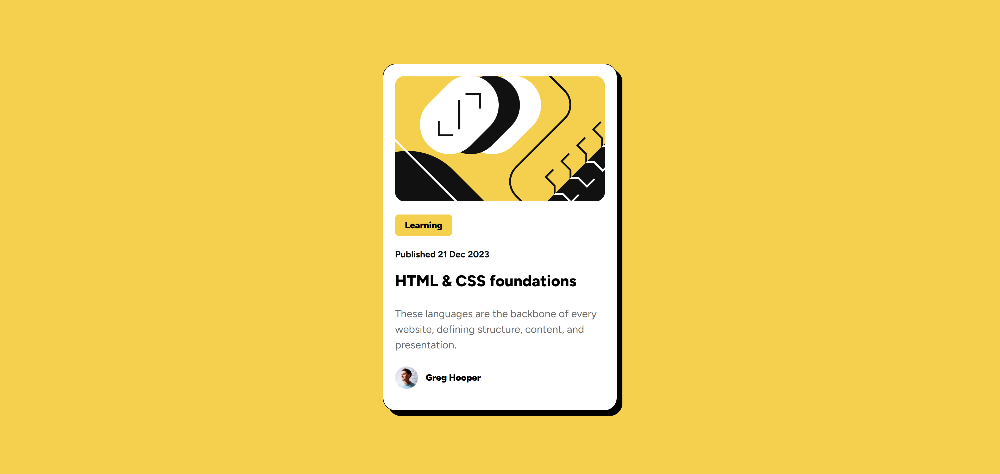

# <h1 align="center">📖 Blog Preview Card</h1>

# 

# <p align="center">

# &#x20; Solution to the <strong>Frontend Mentor - Blog Preview Card</strong> challenge.

# </p>

# 

# <p align="center">

# &#x20; <a href="https://www.frontendmentor.io/challenges/blog-preview-card-ckPaj01IcS">

# &#x20;   

# &#x20; </a>

# 

# &#x20; 

# 

# &#x20; 

# 

# &#x20; 

# </p>

# 

# \---

# 

# 📸 Preview

# 

# <p align="center">

# 

# </p>

# 

# 

# 🔗 Links

# 

# 🌐 Live Demo

# 

# https://YOUR-GITHUB-PAGES-LINK

# &#x20;💻 Repository

# 

# https://github.com/kirujaxx/QR\_FLEX

# 

# 🎯 Frontend Mentor Solution

# 

# https://www.frontendmentor.io/profile/YOUR\_USERNAME

# 

# \---

# 

# ✨ Features

# 

# \- ✅ Semantic HTML5

# \- ✅ Responsive Design

# \- ✅ Flexbox Layout

# \- ✅ Hover Effects

# \- ✅ Mobile Friendly

# \- ✅ Clean CSS Structure

# 

# \---

# 

# 🛠️ Built With

# 

# \- HTML5

# \- CSS3

# \- Flexbox

# \- CSS `min()`

# \- CSS Transitions

# 

# \---

# 

# 📚 What I Learned

# 

# While building this project, I improved my understanding of:

# 

# \- Semantic HTML

# \- Flexbox layouts

# \- Responsive design

# \- CSS transitions

# \- Clean CSS organization

# \- Better class naming

# 

# Example:

# 

# ```css

# .card{

# &#x20;   width:min(90%,360px);

# }

# 

# .author{

# &#x20;   display:flex;

# &#x20;   align-items:center;

# &#x20;   gap:12px;

# }

# 

# .title{

# &#x20;   transition:color .2s ease;

# }

# ```

# 

# \---

# &#x20;📂 Folder Structure

# 

# ```text

# .

# ├── assets

# │   ├── images

# │   └── fonts

# ├── index.html

# ├── style.css

# ├── screenshot.png

# └── README.md

# ```

# 

# \---

# 

# 🚀 Future Improvements

# 

# \- Learn CSS Grid

# \- Improve Accessibility

# \- Add JavaScript Interactions

# \- Practice More Frontend Mentor Challenges

# 

# \---

# 

# 👨‍💻 Author

# 

# \### Ayoub Nya

# 

# \- GitHub: https://github.com/kirujaxx

# \- LinkedIn: https://www.linkedin.com/in/ayoub-nya

# \- Frontend Mentor: https://www.frontendmentor.io/profile/YOUR\_USERNAME

# 

# \---

# 

# 🙏 Acknowledgements

# 

# A big thanks to \*\*Frontend Mentor\*\* for creating high-quality front-end challenges that help developers improve their skills.

# 

# \---

# 

# <p align="center">

# 

# ⭐ If you like this project, consider giving it a star!

# 

# </p>

